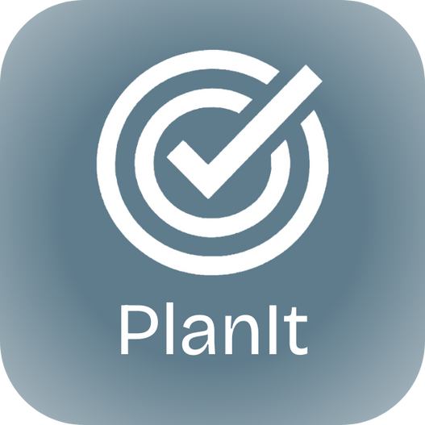

<p align="center">
  
</p>
<h1 align="center">PlanIt</h1>

<p align="center">
  <b>A minimalist, high-performance desktop widget for managing Notion tasks.</b><br>
  Built with Tauri, React, and Rust, PlanIt bridges the gap between your heavy-duty Notion workspace and your daily quick-access needs.
</p>

<p align="center">
  
  
  <a href="https://github.com/phuongoliver/planit/actions/workflows/test.yml"></a>
  <a href="https://github.com/phuongoliver/planit/actions/workflows/release.yml"></a>
</p>

## 🧩 Download

You can download the latest version of PlanIt from our **[Releases Page](https://github.com/phuongoliver/planit/releases)**.

If you use MacOS and see a message saying "App is damaged and can't be opened", run this command in your terminal to allow the app to run: 
```bash
xattr -cr /Applications/PlanIt.app
```

## 🌟 How to Use? 

To use PlanIt, you need to connect it to your Notion workspace and follow [this template](https://topaz-enthusiasm-fb5.notion.site/PlanIt-Plan-Template-9eb32f6a62768376ac1481e62890b6ae?source=copy_link):

1. **Create a Notion Integration**:
   - Go to [Notion My Integrations](https://www.notion.so/my-integrations).
   - Create a new integration and copy the `Internal Integration Token`.

2. **Prepare your Databases**:
   - You need a **Tasks Database** and (optionally) an **Objectives Database**.
   - **Share** both databases with your new Integration (click the `...` menu on the database page -> `Connections` -> Add your integration).
   - Copy the URL link to your Notion page. 

3. **In-App Setup**:
   - Launch PlanIt.
   - Go to **Settings**.
   - Paste your **Token** and the **Notion Page URL**.

## 🤝 Contributing

Contributions are welcome! We want to make this the best desktop companion for Notion users.
Please see [CONTRIBUTING.md](CONTRIBUTING.md) for more details. Huge thanks to everyone who contributes 🙏.

## 📜 License

This project is licensed under the MIT License - see the [LICENSE](LICENSE) file for details.
